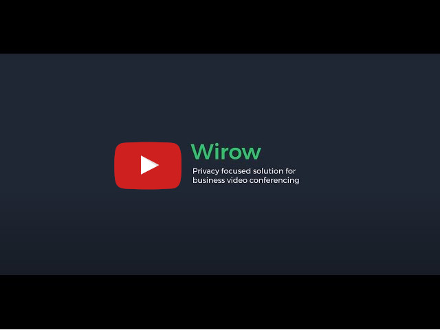
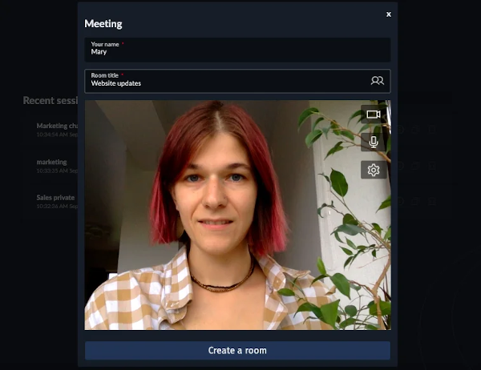
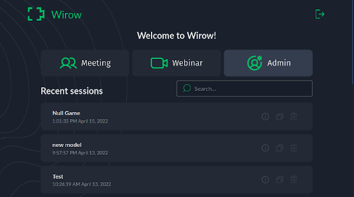
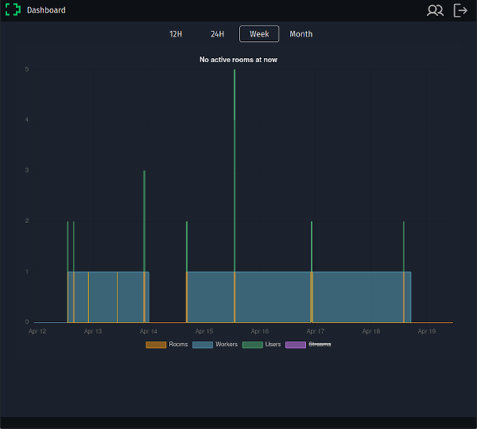

# Wirow video conferencing platform

https://wirow.io

A full featured self-hosted video web-conferencing platform shipped as a single executable.

- Works on Linux and FreeBSD.
- Single executable, no setup is required.
- Let's Encrypt integration - instant SSL certs generation for your web-conferencing host.
- Unlimited meeting rooms and webinars.
- Integrated whiteboard.
- Video calls recording.
- Low memory/CPU consumption due to fast core engine written in C.

## Licensing

Wirow platform community edition is distributed under terms of [AGPLv3 license](https://choosealicense.com/licenses/agpl-3.0/)

For a license to use the Wirow software under conditions other than AGPLv3, or for technical support for this software,
please contact us at info@wirow.io

## How to get support

If you have a question, advice or an issue related to your server setup ask for help at [Wirow Discussion Group](https://github.com/wirow-io/wirow-server/discussions).
Please be patient and note what project maintainers have limited time provide a free support on this forum.

Fill an [Issue](https://github.com/wirow-io/wirow-server/issues) If you believe that Wirow has a software bug.

## Intro

## Guides

- [Wirow Server Administrator's Guide](https://github.com/wirow-io/wirow-server/blob/master/docs/wirow.adoc) ([pdf](https://github.com/wirow-io/wirow-server/blob/master/docs/wirow.pdf))
- [Wirow Server Configuration Reference](https://github.com/wirow-io/wirow-server/blob/master/docs/wirow-configuration.ini)

## Software used by Wirow

- [Mediasoup - C++ WebRTC SFU router](https://github.com/versatica/mediasoup)
- [EJDB2 - Embeddable JSON Database engine](https://github.com/Softmotions/ejdb)
- [IWNET - Asynchronous HTTP Library](https://github.com/Softmotions/iwnet)
- [Excalidraw - A Whiteboard Web UI](https://github.com/excalidraw/excalidraw)
- [FFmpeg](https://ffmpeg.org)
- [Sentry error reporting](https://sentry.io)
- [Svelte Frontend Framework](https://svelte.dev)

